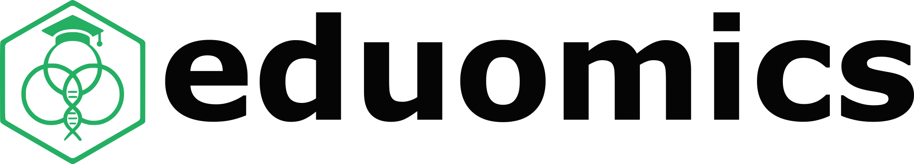
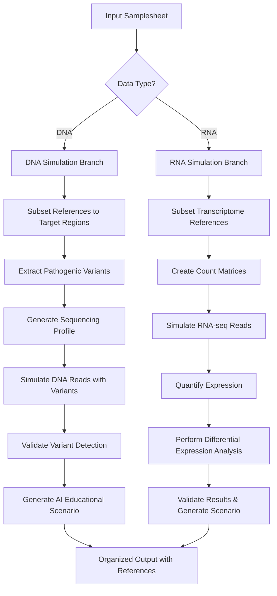

<h1>
  <picture>
    <source media="(prefers-color-scheme: dark)" srcset="docs/images/eduomics_logo_dark.png">
    
  </picture>
</h1>

[](https://github.com/nf-core/eduomics/actions/workflows/ci.yml)
[](https://github.com/nf-core/eduomics/actions/workflows/linting.yml)
[](https://nf-co.re/eduomics/results)
[](https://doi.org/10.5281/zenodo.XXXXXXX)
[](https://www.nf-test.com)

[](https://www.nextflow.io/)
[](https://docs.conda.io/en/latest/)
[](https://www.docker.com/)
[](https://sylabs.io/docs/)
[](https://cloud.seqera.io/launch?pipeline=https://github.com/nf-core/eduomics)

## Introduction

**Eduomics** is a bioinformatics pipeline designed for educational purposes that simulates realistic genomic and transcriptomic datasets. The pipeline creates controlled, validated datasets that can be used to teach bioinformatics analysis workflows, variant calling, and differential gene expression analysis.

The pipeline is built using [Nextflow](https://www.nextflow.io), a workflow tool to run tasks across multiple compute infrastructures in a very portable manner. It uses Docker/Singularity containers making installation trivial and results highly reproducible. The [Nextflow DSL2](https://www.nextflow.io/docs/latest/index.html) implementation of this pipeline uses one container per process which makes it much easier to maintain and update software dependencies. Where possible, these processes have been submitted to and installed from [nf-core/modules](https://github.com/nf-core/modules) in order to make them available to all nf-core pipelines, and to everyone within the Nextflow community!

## Functionality Overview

A graphical view of the pipeline can be seen below.

<h1>
  <picture>
    <source media="(prefers-color-scheme: dark)" srcset="docs/images/eduomics_metromap_dark.svg">
    
  </picture>
</h1>

## Pipeline Logic and Assumptions

### Core Educational Philosophy

The eduomics pipeline is built on the principle that **learning bioinformatics requires realistic, well-characterized datasets** where the "ground truth" is known. Traditional educational approaches often use oversimplified toy datasets or real datasets where the biological truth is unknown, making it difficult for students to validate their analytical approaches.

### Pipeline Architecture

The pipeline operates on two main simulation modes:

#### 1. DNA Variant Simulation Mode

- **Purpose**: Teaches variant calling and clinical interpretation workflows
- **Logic**: Injects known pathogenic variants into specific genomic regions and generates realistic sequencing reads
- **Educational Value**: Students can practice variant calling knowing exactly which variants should be detected

#### 2. RNA Differential Expression Simulation Mode

- **Purpose**: Teaches RNA-seq analysis and differential expression workflows
- **Logic**: Creates realistic count matrices with known differential expression patterns and generates corresponding RNA-seq reads
- **Educational Value**: Students can practice RNA-seq analysis with known differentially expressed genes

### Key Assumptions

1. **Chromosome-specific Analysis**: The pipeline focuses on single chromosomes (typically chr22) to reduce computational requirements while maintaining biological realism
2. **Capture-based Sequencing**: For DNA simulations, the pipeline assumes exome or targeted sequencing using capture regions
3. **Paired-end Sequencing**: All simulations generate paired-end reads reflecting modern sequencing practices
4. **Human Reference**: The pipeline is designed for human genomic data using standard reference genomes
5. **Educational Context**: All simulations include AI-generated educational scenarios to provide biological context

## Schematic Pipeline Workflow Overview



## Main Features

- **🧬 Realistic DNA Simulations**: Generate sequencing data with known pathogenic variants for variant calling practice
- **🧮 RNA-seq Simulations**: Create differential expression datasets with known ground truth
- **🤖 AI-Powered Scenarios**: Automatically generate educational contexts and case studies
- **📚 Educational Focus**: Designed specifically for teaching bioinformatics workflows
- **🔬 Validation Built-in**: Ensures simulated data meets quality standards for educational use
- **📦 Complete Packages**: Provides both simulated data and reference materials needed for analysis
- **⚡ Scalable**: Configurable coverage, sample sizes, and complexity levels

## Documentation

The eduomics pipeline comes with documentation about the pipeline [usage](docs/usage.md) and [output](docs/output.md).

## Usage

> [!NOTE]
> If you are new to Nextflow and nf-core, please refer to [this page](https://nf-co.re/docs/usage/installation) on how to set-up Nextflow. Make sure to [test your setup](https://nf-co.re/docs/usage/introduction#how-to-run-a-pipeline) with `-profile test` before running the workflow on actual data.

First, prepare a samplesheet with your simulation parameters that looks as follows:

`samplesheet.csv`:

```csv
id,type,chromosome,coverage,capture,reps,groups,simthreshold
dna_simulation_1,dna,chr22,100,https://example.com/capture.bed,1,2,0.3
rna_simulation_1,rna,chr22,30,,3,2,0.3
```

Each row represents a simulation to be performed. See the [usage documentation](docs/usage.md) for detailed parameter explanations.

Now, you can run the pipeline using:

```bash
nextflow run eduomics \
   -profile <docker/singularity/.../institute> \
   --input samplesheet.csv \
   --genome GATK.GRCh38 \
   --outdir <OUTDIR>
```

> [!WARNING]
> Please provide pipeline parameters via the CLI or Nextflow `-params-file` option. Custom config files including those provided by the `-c` Nextflow option can be used to provide any configuration _**except for parameters**_; see [docs](https://nf-co.re/docs/usage/getting_started/configuration#custom-configuration-files).

For more details and further functionality, please refer to the [usage documentation](https://nf-co.re/eduomics/usage).

## Pipeline outputs

The pipeline generates organized educational datasets with the following structure:

- **DNA Simulations**: Simulated FASTQ files with known variants, reference materials, and educational scenarios
- **RNA Simulations**: Simulated RNA-seq data with known differential expression, analysis results, and educational contexts
- **Reference Bundles**: All necessary reference files for downstream analysis
- **Educational Materials**: AI-generated scenarios and validation results

For detailed information about the output files and reports, please refer to the [output documentation](docs/output.md).

## Educational Use Cases

### For Instructors

- Create custom datasets for specific learning objectives
- Generate multiple scenarios with different complexity levels
- Provide students with realistic data where ground truth is known
- Validate student analyses against known results

### For Students

- Practice variant calling with datasets containing known pathogenic variants
- Learn RNA-seq analysis with controlled differential expression patterns
- Understand the relationship between sequencing parameters and data quality
- Develop skills in interpreting bioinformatics results

### For Workshops and Training

- Generate datasets tailored to workshop duration and participant skill level
- Create reproducible training materials
- Provide consistent datasets across multiple training sessions

## Credits

Eduomics was originally written by Mariangela Santorsola, Lorenzo Sola, Davide Bagordo, Simone Carpanzano, Francesco Lescai.

## Contributions and Support

If you would like to contribute to this pipeline, please see the [contributing guidelines](.github/CONTRIBUTING.md).

For further information or help, don't hesitate to get in touch with the development team.

## Citations

<!-- TODO nf-core: Add citation for pipeline after first release. Uncomment lines below and update Zenodo doi and badge at the top of this file. -->
<!-- If you use nf-core/eduomics for your analysis, please cite it using the following doi: [10.5281/zenodo.XXXXXX](https://doi.org/10.5281/zenodo.XXXXXX) -->

An extensive list of references for the tools used by the pipeline can be found in the [`CITATIONS.md`](CITATIONS.md) file.
